# EXNO2DS
# AIM:
      To perform Exploratory Data Analysis on the given data set.
      
# EXPLANATION:
  The primary aim with exploratory analysis is to examine the data for distribution, outliers and anomalies to direct specific testing of your hypothesis.
  
# ALGORITHM:
STEP 1: Import the required packages to perform Data Cleansing,Removing Outliers and Exploratory Data Analysis.

STEP 2: Replace the null value using any one of the method from mode,median and mean based on the dataset available.

STEP 3: Use boxplot method to analyze the outliers of the given dataset.

STEP 4: Remove the outliers using Inter Quantile Range method.

STEP 5: Use Countplot method to analyze in a graphical method for categorical data.

STEP 6: Use displot method to represent the univariate distribution of data.

STEP 7: Use cross tabulation method to quantitatively analyze the relationship between multiple variables.

STEP 8: Use heatmap method of representation to show relationships between two variables, one plotted on each axis.

## CODING AND OUTPUT
```
# -----------------------------------------------------
# AIM:
# To perform Exploratory Data Analysis on the Titanic dataset.
# -----------------------------------------------------

# -----------------------------------------------------
# STEP 1: Import required packages
# -----------------------------------------------------
import pandas as pd
import seaborn as sns
import matplotlib.pyplot as plt
import numpy as np

# -----------------------------------------------------
# STEP 2: Load dataset and handle missing values
# -----------------------------------------------------
df = pd.read_csv("titanic_dataset.csv")

print("First 5 rows of dataset:")
print(df.head())

print("\nChecking for null values:")
print(df.isnull().sum())

# Replace nulls for numeric columns with median (safer for skewed data)
numeric_cols = df.select_dtypes(include=['float64', 'int64']).columns
for col in numeric_cols:
    df[col] = pd.to_numeric(df[col], errors='coerce')  # ensure numeric
    df[col].fillna(df[col].median(), inplace=True)

# Replace nulls for categorical columns with mode
categorical_cols = df.select_dtypes(include=['object']).columns
for col in categorical_cols:
    df[col].fillna(df[col].mode()[0], inplace=True)

print("\nNull values after filling:")
print(df.isnull().sum())

# -----------------------------------------------------
# STEP 3: Boxplot for Outlier Detection (Numerical Columns)
# -----------------------------------------------------
plt.figure(figsize=(10,6))
sns.boxplot(data=df[numeric_cols])
plt.title("Boxplot - Outlier Detection")
plt.show()

# -----------------------------------------------------
# STEP 4: Remove Outliers using IQR Method (Numerical Columns)
# -----------------------------------------------------
Q1 = df[numeric_cols].quantile(0.25)
Q3 = df[numeric_cols].quantile(0.75)
IQR = Q3 - Q1

df_iqr_cleaned = df[~((df[numeric_cols] < (Q1 - 1.5 * IQR)) | 
                      (df[numeric_cols] > (Q3 + 1.5 * IQR))).any(axis=1)]
print("\nDataset shape after removing outliers (IQR):", df_iqr_cleaned.shape)
print(f"Rows removed: {df.shape[0] - df_iqr_cleaned.shape[0]}")

# -----------------------------------------------------
# STEP 5: Countplot for Categorical Data (with Survival)
# -----------------------------------------------------
for col in categorical_cols:
    plt.figure(figsize=(6,4))
    sns.countplot(x=col, hue='Survived', data=df_iqr_cleaned)
    plt.title(f"Countplot of {col} (by Survived)")
    plt.show()

# -----------------------------------------------------
# STEP 6: Distribution Plots for Numerical Columns
# -----------------------------------------------------
for col in numeric_cols:
    plt.figure(figsize=(6,4))
    sns.histplot(df_iqr_cleaned[col], kde=True)
    plt.title(f"Distribution of {col}")
    plt.show()

# -----------------------------------------------------
# STEP 7: Cross Tabulation Analysis
# Example: Sex vs Survived
# -----------------------------------------------------
cross_tab = pd.crosstab(df_iqr_cleaned['Sex'], df_iqr_cleaned['Survived'])
print("\nCross Tabulation (Sex vs Survived):")
print(cross_tab)

# Normalized percentages
cross_tab_normalized = pd.crosstab(df_iqr_cleaned['Sex'], df_iqr_cleaned['Survived'], normalize='index')
print("\nNormalized Cross Tab (Sex vs Survived %):")
print(cross_tab_normalized)

# -----------------------------------------------------
# STEP 8: Heatmap of Correlation
# -----------------------------------------------------
plt.figure(figsize=(10,8))
mask = np.triu(df_iqr_cleaned[numeric_cols].corr())  # mask upper triangle
sns.heatmap(df_iqr_cleaned[numeric_cols].corr(), annot=True, cmap="coolwarm", mask=mask)
plt.title("Heatmap of Correlation Matrix")
plt.show()

# -----------------------------------------------------
# STEP 9: Save cleaned dataset
# -----------------------------------------------------
df_iqr_cleaned.to_csv("titanic_cleaned.csv", index=False)
print("\nCleaned dataset saved as 'titanic_cleaned.csv'")
print("\nEDA on Titanic dataset Completed Successfully!")

```
# OUTPUT
[text](exno2output.txt)
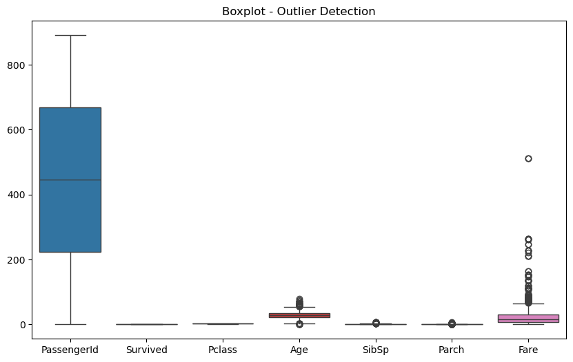
 
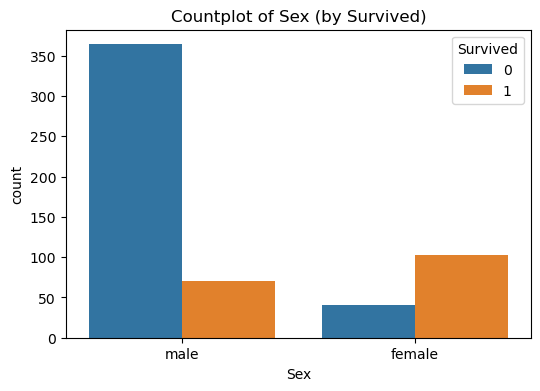 
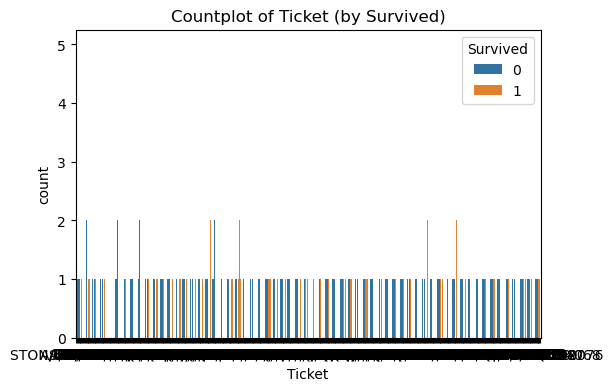
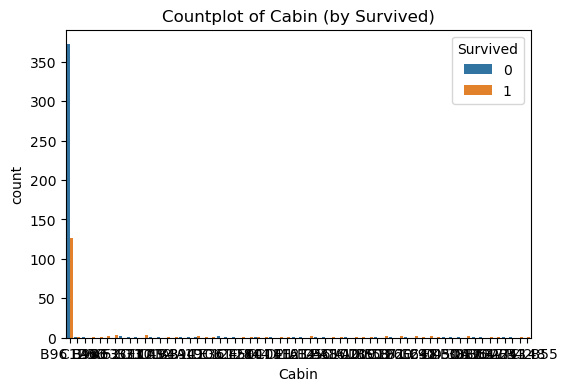 
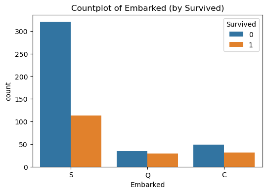
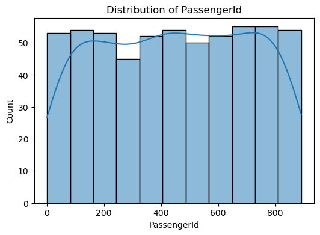 
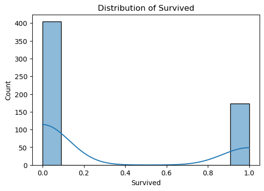 
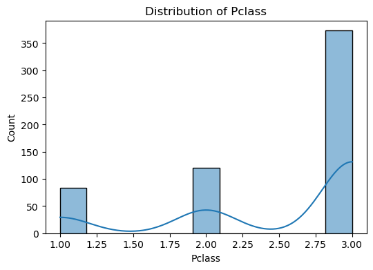 
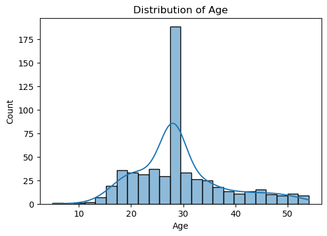


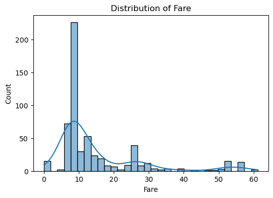
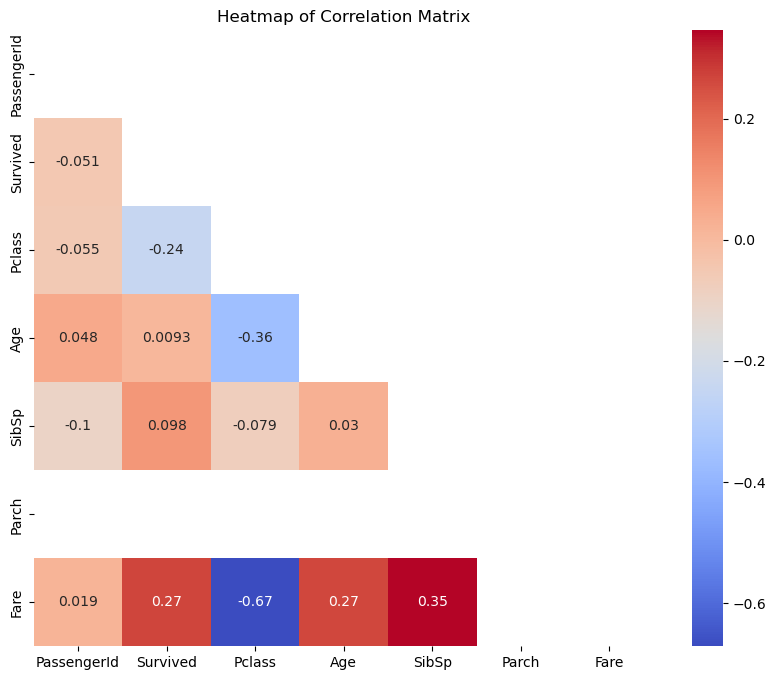

# RESULT

“Exploratory data analysis of the Titanic dataset, including missing value imputation, outlier removal, and distributional and correlation assessment, reveals key survival patterns associated with passenger sex, class, and age, producing a clean dataset ready for predictive modeling.”